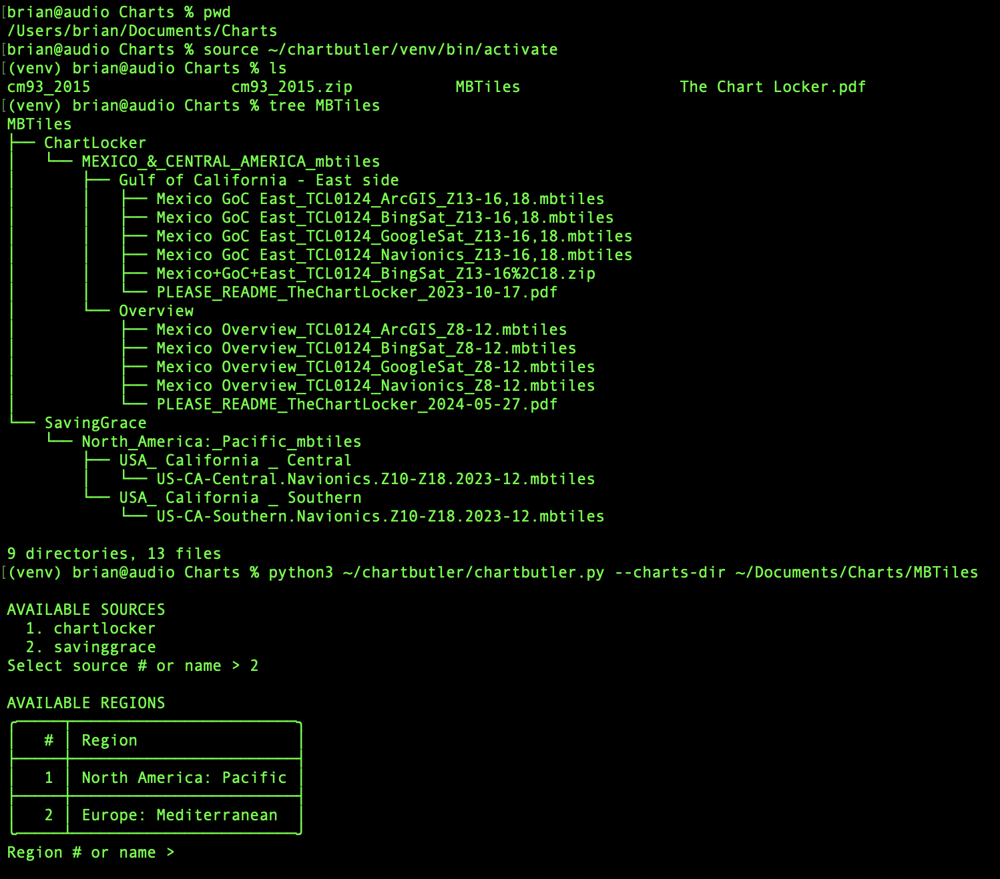

# ChartButler

ChartButler is a command-line utility to download MBTiles files from multiple sources, including:
- The Chart Locker (https://chartlocker.brucebalan.com/) by Bruce Balan
- Sailing Grace Charts (https://sailingamazinggrace.com/charts) by S/Y Grace

It supports both anonymous HTTP downloads and premium downloads using MediaFire accounts (via cookies or API) for The Chart Locker source.

## Features
- Scrape regions and file listings from The Chart Locker or Sailing Grace sites.
- Interactive selection of region and files to download.
- Anonymous HTML scraping method for public files.
- Premium support via MediaFire API (App ID 42511) or cookies.txt.
- Automatic extraction of ZIP archives after download.

## Requirements
This script is written in Python 3.6+ and depends on the following packages:

```
requests
beautifulsoup4
tqdm
tabulate
fuzzywuzzy
rich
```

Optional packages for enhanced functionality:
```
python-Levenshtein    # faster fuzzy matching
mediafire             # MediaFire API support for premium downloads
```

## Installation
It is strongly recommended to use a Python virtual environment:

```bash
python3 -m venv venv
source venv/bin/activate
pip install -r requirements.txt
```

## Usage
```bash
python chartbutler.py --source {chartlocker,savinggrace} [--cookies COOKIES_FILE] [--email EMAIL [--password PASSWORD]] [--charts-dir OUTPUT_DIR]
```

- `--source`: choose which site to download from: `chartlocker` (default) or `savinggrace`.
- `--cookies`: path to cookies.txt exported from your browser for MediaFire sessions (ChartLocker only).
- `--email`, `--password`: MediaFire account credentials for premium API access (ChartLocker only).
- `--charts-dir`: destination directory for downloaded charts (default: current directory).

The script will prompt you to select a region and then the files to download.

## Examples

A typical workflow keeps the script in one directory and downloads charts into a separate folder. For example:




## Notes
- The cookie-based download method has not been thoroughly tested and may be unstable.
- The script is not affiliated with or endorsed by The Chart Locker project or MediaFire.

## Credit
This utility accesses content hosted on:
- The Chart Locker by Bruce Balan
- Sailing Grace Charts by S/Y Grace
All rights to the original data belong to the respective site owners.

## Acknowledgements
This script was produced with the help of OpenAI Codex models (o3 and o4-mini).